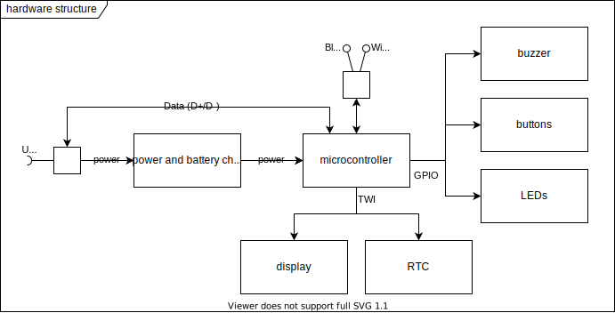

Hardware Architecture {#hardware_architecture}
=====================

The Task-Tracker-Device consists of hardware which is described in this chapter.

The coarse structure of the hardware is sketched in the following diagram:

- The **microcontroller** block represents the used microcomputer including its immediate external components which are necessary for general operation.
  This block is realized by a the development board [ESP32-S3-DevKitC-1](https://docs.espressif.com/projects/esp-idf/en/latest/esp32s3/hw-reference/esp32s3/user-guide-devkitc-1.html).
  It includes a UART to USB transciever for convenient connection to a host system.
  A DC voltage converter from 5V to 3.3V is also included.
- The **power and battery charger** provides an integrated limited power source.
  It is capable to provide uninterrupted power for the other components while charging or disconnected.
- A **USB** connector is used for power and data.
  Serial communication is transported over USB data.
  The microcontroller also acts as a USB mass storage device to a USB host.
- A OLED **display** is connected via I2C to the microcontroller.
  It has 124x64 monochrome pixels.
- A real-time clock (**RTC**) provides the current wall-clock time to the microcontroller.
- **LEDs** and a **buzzer** are use to advertise states or events to the user.
- **Buttons** can be used by the user to directly interact with the device.